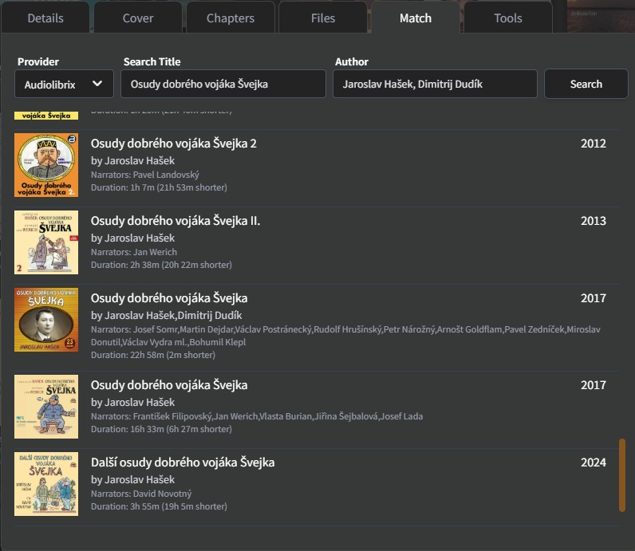
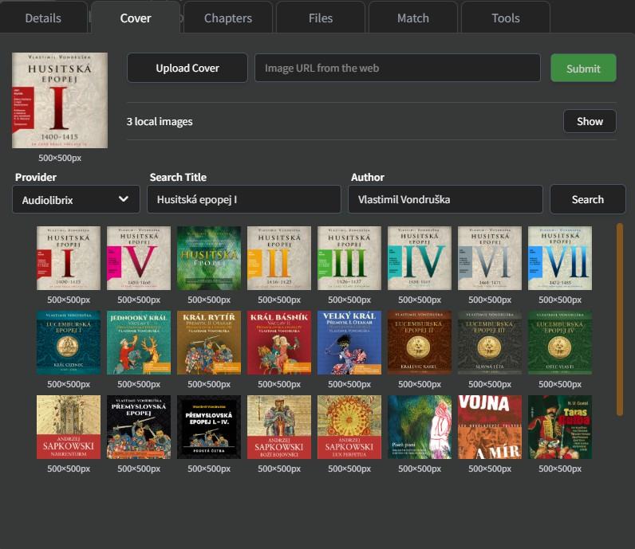
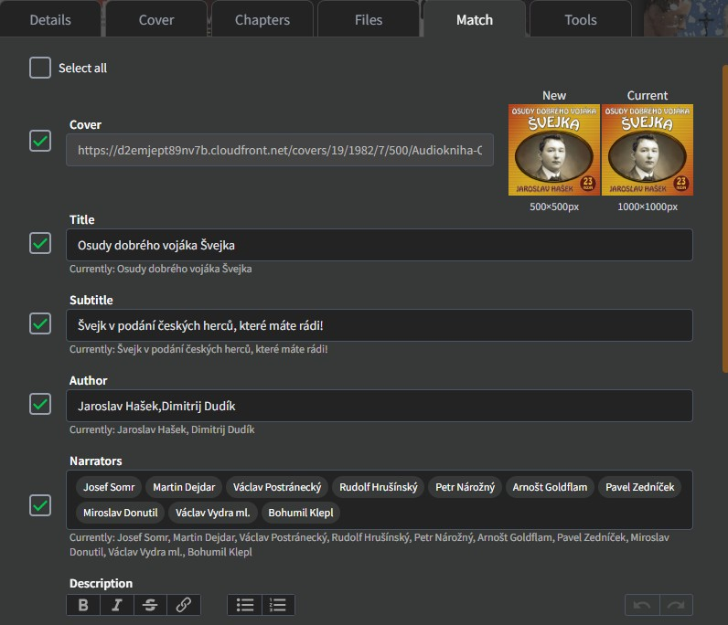
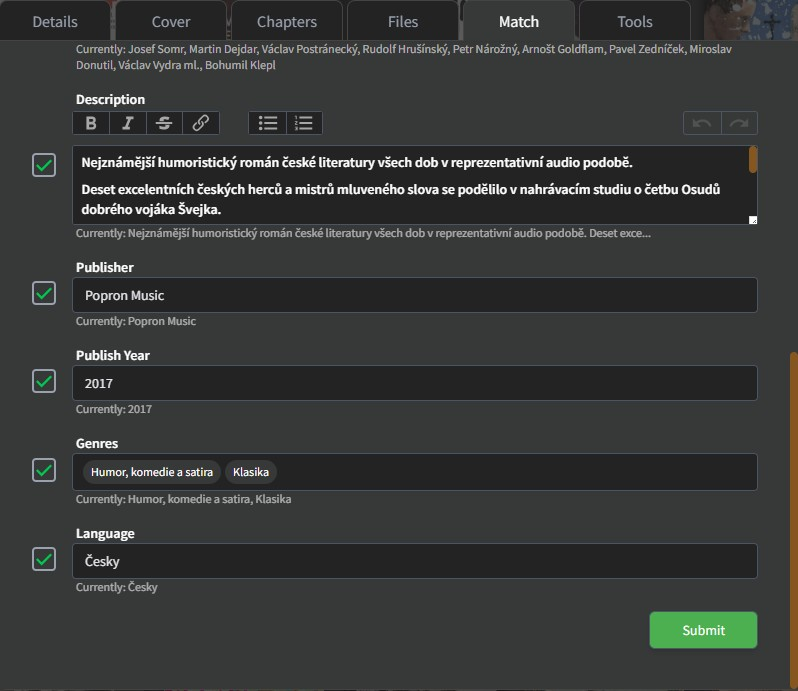
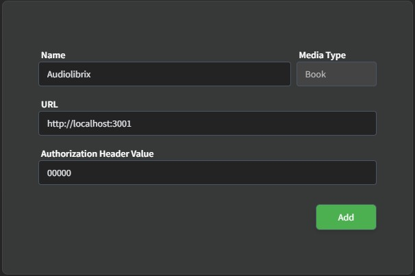

# audiolibrix-abs


Custom **Audiobookshelf Metadata Provider** that retrieves audiobook metadata from **Audiolibrix.com**.

Supports Czech audiobooks and automatically fetches metadata for your library.

<a href="https://www.buymeacoffee.com/slabak007" target="_blank"></a>


# Features

The provider fetches metadata from Audiolibrix including:

- Cover image
- Title
- Subtitle
- Author(s)
- Narrator(s)
- Publisher
- Published year
- Series
- Genres
- Language
- Description


# Screenshots

## List of matches





## View of matched data






# Installation

## Prerequisites

You must have installed:

- Docker
- Docker Compose


# Setup

Create a `compose.yml` file with the following content:

```yaml
services:
  audiolibrix-abs:
    image: slabak007/audiolibrix-abs
    container_name: audiolibrix-abs
    restart: unless-stopped
    ports:
      - "3001:3001"
```
####

Pull the latest image:
```
docker compose pull
```
Start the container:
```
docker compose up -d
```

### Updating
To update to the newest version:
```
docker compose pull
docker compose up -d
```

### Stop the application

```
docker compose down
```

### View logs

```
docker-compose logs -f
```

## Using the provider in Audiobookshelf
1. Open Audiobookshelf Settings
2. Go to Item Metadata Utils
3. Open Custom Metadata Providers
4. Click on Add
5. Name: Audiolibrix
6. URL: http://YOUR-IP:3001
7. Authorization Header Value: The value can be anything, but it must not be empty.
8. Save

### Screenshots of provider setup


### Docker Hub
Docker image is available here:
https://hub.docker.com/r/slabak007/audiolibrix-abs
